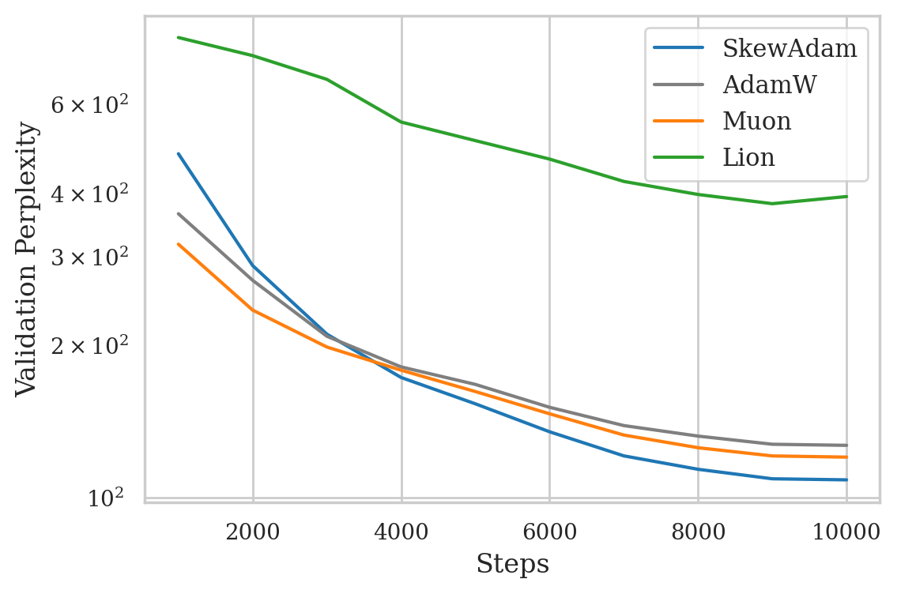
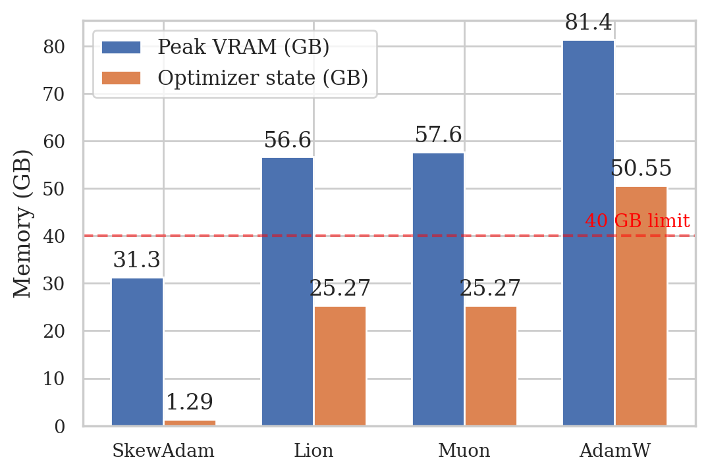
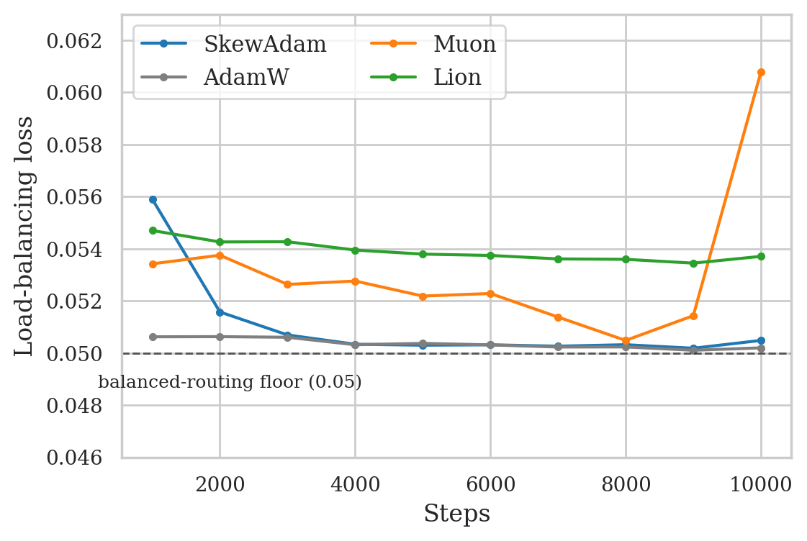

# SkewAdam

**Tiered optimizer state allocation for memory-efficient Mixture-of-Experts training.**

[](LICENSE)
[](https://www.python.org/)
[](https://pytorch.org/)

Training a 6.78B-parameter Mixture-of-Experts model with AdamW allocates **50.6 GB of optimizer state** to update **12.6 GB of bfloat16 weights**. SkewAdam cuts that state to **1.29 GB (−97.4%)** and peak training memory from **81.4 GB to 31.3 GB** — small enough for a single 40 GB GPU — while reaching **lower validation perplexity than AdamW, Muon, and Lion** under matched conditions.

The idea is simple: an MoE is not a homogeneous bag of parameters, so its optimizer shouldn't treat it like one. SkewAdam *skews* its state budget toward where it pays.

| Tier | Share of params | Momentum | Second moment | State cost |
|---|---|---|---|---|
| **Backbone** (embeddings, attention, dense FFN) | 5.0% | fp32 | factored | 1.27 GB |
| **Experts** (128 SwiGLU experts) | 95.0% | none | factored | 12.6 MB |
| **Router** (top-2 gate) | 0.008% | none | full fp32 | 2.1 MB |

The backbone sees every token, so momentum earns its keep there. Each expert sees ~1/64 of tokens under top-2-of-128 routing, so experts keep only a factored (row/column) second moment — dropping their momentum buffer alone saves 24 GB. The router is tiny but steers all the traffic, so it keeps exact per-logit second moments for 2 MB.

## Results

6.78B-parameter MoE, 10,000 steps (~82M tokens of OpenWebText), all optimizers started from the same initialization and fed identical batches in identical order, on a single NVIDIA H200:

| Optimizer | State (GB) | Peak VRAM (GB) | Tokens/s | Val. PPL ↓ | Balance loss |
|---|---:|---:|---:|---:|---:|
| **SkewAdam** | **1.29** | **31.3** | 5,000 | **108.4** | 0.0505 |
| AdamW | 50.55 | 81.4 | 4,692 | 126.8 | **0.0502** |
| Muon | 25.27 | 57.6 | 3,409 | 120.2 | 0.0608 |
| Lion | 25.27 | 56.6 | **5,075** | 393.7 | 0.0537 |

<p align="center">
  
  
</p>

AdamW and Muon converge faster for the first 3,000 steps; SkewAdam passes both by step 4,000 and finishes 14.5% below AdamW. Routing stays balanced — from step 4,000 the load-balancing loss sits within 1% of its uniform floor (0.05):

<p align="center">
  
</p>

Every number above is read directly from the JSON logs in this repository (`runs/metrics_*.json`, `eval_metrics_*.json`) — nothing is hand-entered.

## Quickstart

```bash
pip install torch numpy transformers bitsandbytes datasets lm_eval

# Train all four optimizers in sequence (one shared init, identical batches):
CUDA_VISIBLE_DEVICES=0 python train.py --optimizers "skewadam,adam,lion,muon"

# Or a single optimizer:
CUDA_VISIBLE_DEVICES=0 python train.py --optimizers "skewadam"

# Zero-shot evaluation of a checkpoint (PIQA, WinoGrande, HellaSwag, ARC-C):
python evaluate.py runs/best_skewadam.pt

# Regenerate the figures from the logged metrics:
pip install matplotlib seaborn
python plot_metrics.py
```

Training streams OpenWebText and splits it 95/5 by document hash, so the validation set is identical across runs and machines. The full run (10,000 steps × 64 sequences × 128 tokens) was done on one H200; with SkewAdam it fits comfortably on any 40 GB card.

## Using SkewAdam in your own training loop

`skewadam.py` is a single-file, dependency-free `torch.optim.Optimizer`. The tier policy is expressed through parameter groups:

```python
from skewadam import SkewAdam

optimizer = SkewAdam([
    # dense backbone: momentum + factored second moment
    {"params": dense_params,  "use_momentum": True,  "use_factored": True,  "weight_decay": 0.05},
    # experts: factored second moment only (no momentum buffer)
    {"params": expert_params, "use_momentum": False, "use_factored": True,  "weight_decay": 0.05},
    # router: exact second moment, no weight decay
    {"params": router_params, "use_momentum": False, "use_factored": False, "weight_decay": 0.0},
], lr=3e-4)
```

Updates are RMS-clipped (Adafactor-style, threshold 1.0), and bfloat16 parameters are written back through a dithered rounding that approximates unbiased stochastic rounding.

> [!IMPORTANT]
> **Scaling caveat — weight decay.** With bfloat16 master weights, the decoupled weight-decay step (`lr × wd ≈ 1.5e-5` relative) falls more than two orders of magnitude below the bfloat16 ULP (2⁻⁷) and rounds to a no-op. This was uniform across all optimizers in our comparison — a controlled but effectively unregularized setting. **If you scale this recipe to production horizons, reintroduce weight decay by fusing the decay term into the float32 update before the stochastically rounded cast.** We have not yet validated long-horizon training in that configuration.

## Repository layout

```
skewadam.py          The optimizer (single file, no dependencies beyond torch)
train.py             6.78B MoE training harness + AdamW/Lion/Muon/GaLore baselines
evaluate.py          lm-eval-harness zero-shot evaluation of saved checkpoints
plot_metrics.py      Regenerates the paper figures (PDF) from runs/*.json
runs/                Per-step metrics for the four reported runs (JSON)
runs/h100/           Adafactor/GaLore/SkewAdam follow-up on an H100 MIG slice
runs/amd-ablation/   Tier ablation (4 SkewAdam variants) on an MI300X
eval_metrics_*.json  Zero-shot results per optimizer
figures/             Paper figures (PDF)
assets/              README figures (PNG) + the script that renders them
experiments/         Standalone studies (int32 optimizer-state boundary)
```

## Notes and caveats

- **Model:** decoder-only, 2 blocks (1 dense SwiGLU + 1 MoE of 128 experts, hidden 4096), d_model 4096, GQA 32/8, GPT-2 BPE. 6,784M parameters, ~440M active per token. Shallow by intent: it concentrates 95% of parameters in the expert bank, the population whose optimizer state the study stresses.
- **Single run per optimizer** at standard learning rates (3e-4 AdamW/SkewAdam, 1e-4 Lion, 0.02 Muon). Lion is known to be learning-rate sensitive; a sweep could narrow its gap.
- **Adafactor and GaLore** were run in a same-protocol follow-up on an NVIDIA H100 NVL (47 GB MIG slice) — same code, data, seed, and shared initialization. SkewAdam, re-run in that batch as the anchor, landed at 108.9 vs 108.4 on the H200, so the protocol transfers across hardware:

  | Optimizer | State (GB) | Peak VRAM (GB) | Val. PPL ↓ |
  |---|---:|---:|---:|
  | **SkewAdam** | 1.29 | 31.3 | **108.9** |
  | Adafactor | 0.01 | 29.6 | 149.5 |
  | GaLore-style (rank 128) | — | 31.7 | 1,839.9 |

  State sizes are analytic, like every state number in the paper (the trainer's accounting helper covers only adam/lion/muon/skewadam and logs `nan` for the other two — that's a logging gap, not a measurement). Adafactor's 0.01 GB follows from its published layout: factored second moments only, no momentum. The measured VRAM agrees: Adafactor peaks 1.7 GB below SkewAdam, which is SkewAdam's 1.29 GB of state that Adafactor doesn't carry. GaLore-style is left "—" rather than guessed.

  Adafactor shares SkewAdam's factored estimator but **drops momentum entirely** and plateaus 40 perplexity points behind. The GaLore number is a single untuned configuration of the trainer's own implementation; read it as a caution about low-rank projections of sparse expert gradients, not a verdict on GaLore. Logs and metrics: [runs/h100](runs/h100).
- **Tier ablation** (MI300X, 192 GB, same protocol — [runs/amd-ablation](runs/amd-ablation)). Toggling each tier of the policy one at a time:

  | Variant | State (GB) | Peak VRAM (GB) | Val. PPL |
  |---|---:|---:|---:|
  | **SkewAdam** (full policy) | **1.29** | **31.4** | 108.9 |
  | + momentum on experts | 25.29 | 55.4 | 108.7 |
  | factored router | 1.28 | 31.4 | 108.2 |
  | uniform (momentum + factored everywhere) | 25.29 | 55.4 | 108.3 |

  All four are a **perplexity tie** (108.2–108.9, single-seed noise) with identical load balance (~0.050); what varies 20× is optimizer state. So the honest reading is *memory-at-parity*, not a perplexity advantage: adding momentum to the experts costs 24 GB and buys nothing, which is exactly what the policy discards — full-momentum perplexity is recovered from backbone momentum alone. It also relocates the Adafactor gap: `uniform` (uniform allocation *with* momentum) also reaches ~108, so the gap to Adafactor is **momentum + its decay schedule, not the tiered allocation**. SkewAdam here (108.9) matches its H200 (108.4) and H100 (108.9) numbers — a third platform, second vendor.
- Zero-shot scores after 82M tokens are near chance for all optimizers, as expected at that token budget; they are included for completeness.
- **8-bit optimizer states hit a hard int32 wall** that factored state does not: bitsandbytes' `Adam8bit` kills the process (C++ `exit(1)`, uncatchable) the moment a single parameter tensor reaches 2³¹ elements, while SkewAdam and fp32 Adam cross the boundary cleanly. Measured boundary, repro script, and raw logs in [experiments/int32-boundary](experiments/int32-boundary).

## Support this work

This project was self-funded on rented GPU time, and the compute budget — not the experimental design — set the scale of the study. Planned next steps: deeper multi-layer MoE topologies, longer horizons with properly fused weight decay, and matched Adafactor/GaLore baselines. If you'd like to collaborate or can help with compute credits, reach out: **nuemaan.research@gmail.com**.

## Citation

Paper link coming soon (arXiv preprint under preparation). In the meantime:

```bibtex
@misc{malik2026skewadam,
  title  = {Where Should Optimizer State Live? Tiered State Allocation for
            Memory-Efficient Mixture-of-Experts Training},
  author = {Malik, Nuemaan},
  year   = {2026},
  note   = {Preprint},
}
```

## License

[MIT](LICENSE)
